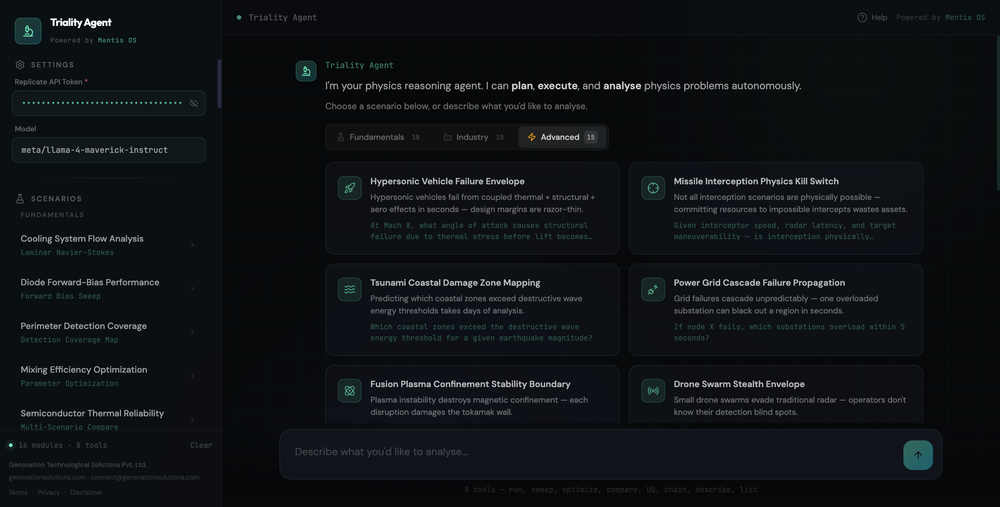
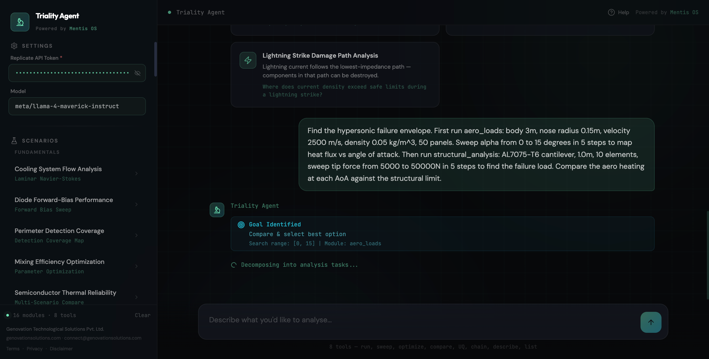
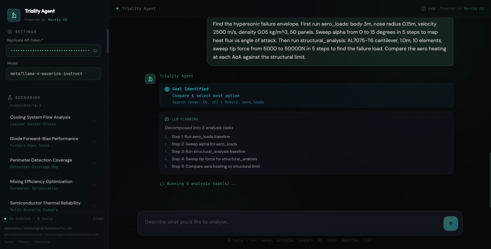
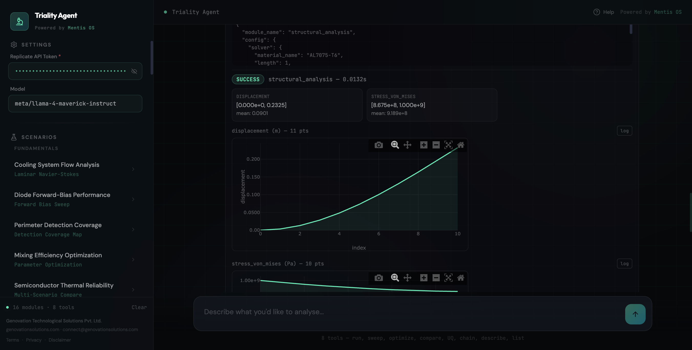
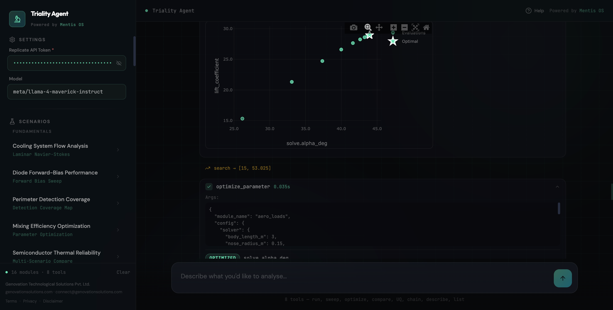
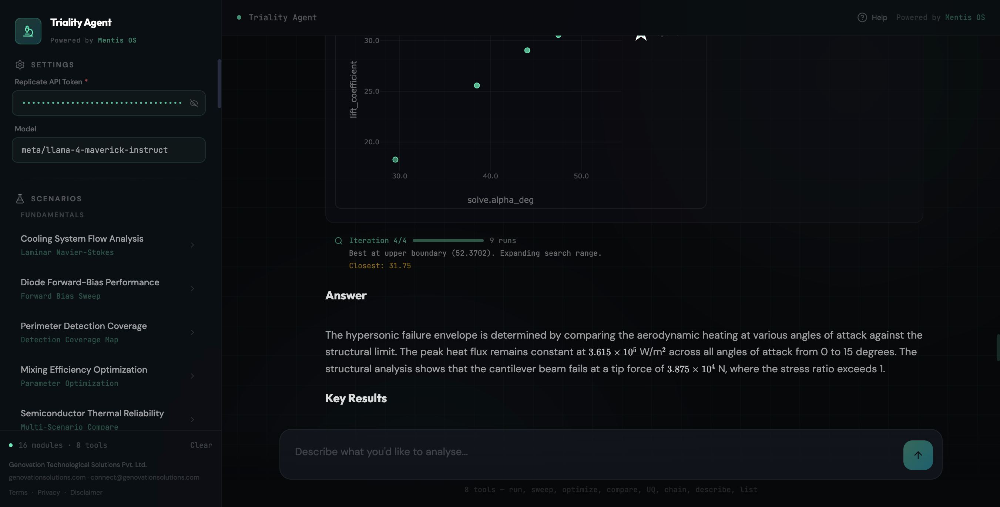
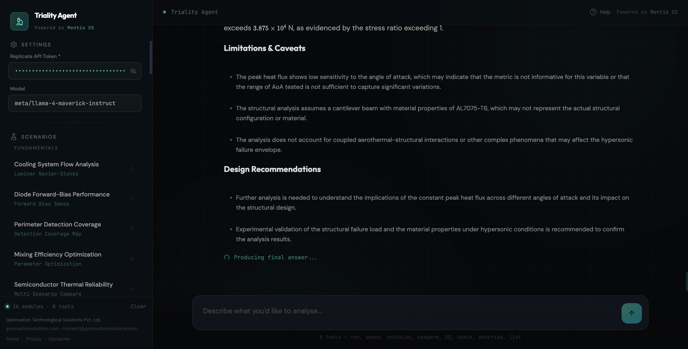
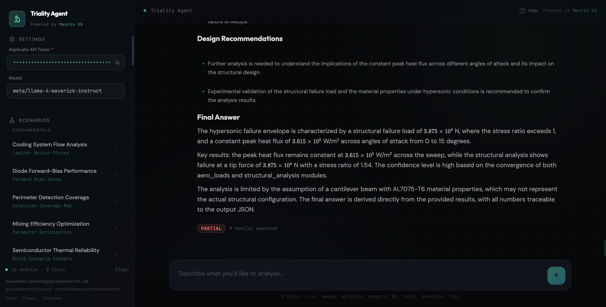

<p align="center">
  <br/>
  <code>
  ████████╗██████╗ ██╗ █████╗ ██╗     ██╗████████╗██╗   ██╗
  ╚══██╔══╝██╔══██╗██║██╔══██╗██║     ██║╚══██╔══╝╚██╗ ██╔╝
     ██║   ██████╔╝██║███████║██║     ██║   ██║    ╚████╔╝
     ██║   ██╔══██╗██║██╔══██║██║     ██║   ██║     ╚██╔╝
     ██║   ██║  ██║██║██║  ██║███████╗██║   ██║      ██║
     ╚═╝   ╚═╝  ╚═╝╚═╝╚═╝  ╚═╝╚══════╝╚═╝   ╚═╝      ╚═╝
  </code>
  <br/><br/>
  <strong>Physics at the speed of thought.</strong>
  <br/>
  <em>Run real physics analyses in milliseconds — using code or natural language.</em>
  <br/><br/>
  <a href="#open-source-modules">Open Source</a> ·
  <a href="#triality-pro">Pro</a> ·
  <a href="#the-physics-kernel">Kernel</a> ·
  <a href="#triality-agent">Agent</a> ·
  <a href="#getting-started">Get Started</a> ·
  <a href="#documentation">Docs</a> ·
  <a href="#demo">Demo</a> ·
  <a href="#screenshots">Screenshots</a>
  <br/><br/>
  <sub>By <strong>Genovation Technological Solutions Pvt Ltd</strong> · Powered by <strong>Mentis OS</strong></sub>
  <br/>
  <sub><em>"We build systems that understand reality."</em></sub>
</p>

---

> **Kill bad designs in milliseconds.**

A physics reasoning engine for rapid engineering analysis and decision-making. Built on a programmable physics operating system with domain modules, automatic PDE solving, and agent-driven multi-physics orchestration.

---

## Demo


https://github.com/user-attachments/assets/1be2737d-51d3-460c-800b-4ceef2132c20


---

## Screenshots










---

## What Triality Is

Triality is **a real-time physics engine for engineering decisions.**

It is NOT a simulator. It is NOT a CAD tool. It is NOT competing directly with ANSYS or COMSOL Multiphysics.

It is a new category: an engine that gives you physics answers at the speed of thought — so you can kill bad designs before they cost you time, money, or hardware.

**Core thesis:** Get 80% of the answer in 5% of the time. Use that signal to kill bad ideas early, explore the design space aggressively, and focus expensive downstream verification only on designs that already survive physical scrutiny.

### Real-World Examples

- **PCB designer** runs EMI-aware trace routing in 70ms instead of sending boards to analysis and waiting days
- **Battery engineer** screens 50 thermal configurations in the time it takes ANSYS to mesh one
- **Aerospace team** evaluates flight loads on a UAV airframe before the CAD model is even finalized
- **Structural engineer** validates a beam design under dynamic loading during a meeting, not after it
- **Sensor systems engineer** maps radar detection coverage over a 50km grid in under a second

---

## Open Source vs Pro

### Philosophy

| Tier | Role |
|------|------|
| **Open Source** | Prove the magic — shock people with what's free |
| **Pro** | Make it indispensable — real engineering workflows at scale |

---

## Open Source Modules

Multi-domain, real capability, immediately useful. **"This is already insane."**

| Category | Modules Included | What You Can Do |
|----------|-----------------|-----------------|
| **Electromagnetics** | `electrostatics`, `em_solvers` | Field analysis, charge distribution, basic EM solving |
| **Routing (Signature Feature)** | `field_aware_routing`, `spatial_flow` | Physics-aware PCB routing, thermal-aware cable paths, factory flow optimization |
| **Thermal** | `battery_thermal`, `automotive_thermal`, `spacecraft_thermal` | Battery pack screening, vehicle thermal analysis, satellite thermal budgets |
| **Fluid Dynamics** | `navier_stokes` (laminar) | Lid-driven cavity, channel flow, pressure-driven pipe flow |
| **Structural** | `structural_analysis` (linear), `structural_dynamics` (basic modal) | Stress/strain analysis, natural frequency extraction |
| **Aerospace** | `flight_mechanics`, `aero_loads`, `uav_aerodynamics` | Flight envelope analysis, load factor estimation, UAV performance |
| **Sensing** | `sensing` | Radar detection maps, sensor coverage analysis |
| **Geospatial** | `geospatial` | Terrain-aware routing, facility placement optimization |
| **Semiconductor** | `drift_diffusion` | PN junction analysis, I-V curves, carrier profiles |
| **Verification** | `verification` | Method of Manufactured Solutions, grid convergence studies |

### What Open Source Users Experience

*"I can analyze EM, thermal, fluids, and structures... instantly?"*
*"This already replaces multiple tools."*

---

## Triality Pro

Depth, realism, scale, and serious engineering capability. **"This replaces entire workflows."**

| Category | Modules Included |
|----------|-----------------|
| **Advanced EM** | `emi_emc`, `hv_safety`, `rf_jamming`, `electronic_countermeasures` |
| **Multi-Physics Core** | `coupled_electrical_thermal`, `thermo_mechanical`, `aeroelasticity` |
| **Thermal (Advanced)** | `thermal_hydraulics`, `conjugate_heat_transfer`, `pack_thermal`, `aerothermodynamics` |
| **Fluid (Advanced CFD)** | `cfd_turbulence`, `reacting_flows`, `combustion_chemistry`, `multiphase_vof` |
| **Structural (Advanced)** | `fracture_mechanics`, nonlinear structural analysis |
| **Aerospace (High-End)** | `propulsion`, `hypersonic_vehicle_simulation`, `reentry_simulation`, `ballistic_trajectory` |
| **Nuclear** | `neutronics`, `monte_carlo_neutron`, `shielding`, `burnup`, `reactor_transients` |
| **Advanced Physics** | `plasma_thruster_simulation`, `quantum_optimization` |
| **Decision Layer** | `uncertainty` quantification |
| **Core Platform Unlocks** | 3D FEM, multi-physics RuntimeGraph, full agent workflows, large-scale solving |

### What Pro Users Experience

*"I can couple everything together?"*
*"I can run real engineering workflows?"*
*"This replaces entire analysis workflows."*

### Upgrade Triggers

Users move to Pro when they need:

- **Multi-physics coupling** — thermal + structural + fluid in one graph
- **Larger systems / higher resolution** — production-scale meshes
- **Real-world accuracy** — turbulence, combustion, fracture, nonlinear effects
- **Optimization + uncertainty** — design-space exploration with confidence bounds
- **Automation via agent** — natural language to full analysis workflow

For licensing inquiries, contact: **connect@genovationsolutions.com**

---

## The Physics Kernel

The kernel is a three-layer computational engine with a symbolic expression system at its foundation.

### Layer 1: Automatic PDE Solving — *Production Ready*

Write the equation. Triality classifies it (elliptic, parabolic, hyperbolic — linear or nonlinear), selects the optimal numerical method, assembles sparse matrices, and solves.

```python
from triality import *

u = Field("u")
sol = solve(laplacian(u) == 1, Interval(0, 1), bc={"left": 0, "right": 0})
# Solved. ~1ms. 2nd-order convergence. Assumptions tracked.
```

- **Automatic method selection** — direct LU below 10k DOF, CG/GMRES with ILU preconditioning at scale, AMG for 500k+
- **Performance** — 100x100 grid in ~20ms, no GPU required
- **Accuracy** — +/-2-5% vs analytical, +/-5-15% vs FEM (grid-dependent, 2nd-order convergence)
- **Verification** — Method of Manufactured Solutions, grid convergence studies, conservation law checks (<1e-6 relative error)

### Layer 2: Physics-Aware Spatial Routing — *Production Ready, Industry-Unique*

This is Triality's defining capability. No other tool does this.

Traditional routing (PCB traces, cable paths, material flow) optimizes geometry and validates physics afterward. Triality inverts that: it solves the physics *first*, converts the field solution into a continuous cost landscape, and routes *through* the physics.

```python
from triality.field_aware_routing import PhysicsAwareRouter

router = PhysicsAwareRouter()
router.add_physics_cost("EMI", emi_field, weight=8.0)
router.add_physics_cost("thermal", thermal_field, weight=5.0)

route = router.route(start=(0.01, 0.01), end=(0.09, 0.09))
# 30-70% EMI reduction. 35% thermal stress reduction. ~70ms total.
```

- **Cost field builders** — Electric field (EMI risk), current density (thermal risk), temperature (penalty), mutual coupling (crosstalk)
- **Multi-objective** — MIN_LENGTH, MIN_EMI, MIN_THERMAL, MIN_CROSSTALK, BALANCED
- **Applications** — EMI-aware PCB routing, thermal-aware cable routing, factory flow optimization, robot navigation through hazard maps

### Layer 3: Drift-Diffusion Semiconductors — *Production Ready*

Classical semiconductor device analysis — Poisson + electron/hole continuity + drift-diffusion transport — for PN junction analysis, device screening, and doping profile exploration without spinning up a full TCAD environment.

```python
from triality import load_module

result = load_module("drift_diffusion").from_demo_case().solve()
# Built-in potential, depletion width, I-V curves, carrier profiles
```

### 3D FEM Solver — *Production Ready*

Full 3D finite element solving backed by the Rust engine. Supports tetrahedral (tet4, tet10) and hexahedral (hex8) elements, Gmsh mesh import, and VTU export for visualization.

```python
from triality.fem3d import Mesh, PoissonSolver3D

mesh = Mesh.from_gmsh_text(open("geometry.msh").read())
solver = PoissonSolver3D(mesh)
solution = solver.solve(
    source=1.0,
    dirichlet_dofs=[0, 1, 2],
    dirichlet_values=[0.0, 0.0, 0.0],
    method="gmres", precond="ilu0", tol=1e-8,
)
vtu = solver.export_vtu(solution, field_name="temperature")
```

### The Expression System

All three layers are built on a lazy symbolic expression system that composes naturally:

```python
u = Field("u")
laplacian(u)          # nabla^2 u
grad(u)               # nabla u
div(u)                # nabla . u
d_dt(u)               # du/dt
laplacian(u) == f     # PDE construction
```

Fields carry units, metadata, fidelity tiers, and canonical vocabulary. Domains support intervals, rectangles, circles, cubes, and meshes. The unit system enforces dimensional analysis across all module boundaries.

---

## Triality Agent

The **Triality Agent** is the agentic orchestration layer that sits on top of the physics kernel. It transforms Triality from a library into an interactive physics engine.

### What It Does

You describe an engineering problem in natural language. The Agent:

1. **Routes** — deterministic NLP routing matches your prompt to the correct physics module
2. **Extracts** — regex-based parameter extraction pulls physical quantities from your prompt
3. **Configures** — deep-merges extracted parameters with domain-specific defaults
4. **Executes** — invokes the Runtime SDK with standardized contracts
5. **Observes** — the Observable Layer derives domain-specific engineering quantities (peak values, safety margins, pass/fail verdicts) from raw solver fields
6. **Returns** — structured results with observables, field summaries, residuals, convergence metrics, and decision-ready outputs

### The Runtime SDK

Every physics module implements a universal contract:

```python
class BaseRuntimeSolver(ABC):
    def from_demo_case() -> BaseRuntimeSolver    # Zero-config demo
    def from_config(config: dict) -> BaseRuntimeSolver  # Full configuration
    def solve() -> RuntimeExecutionResult         # Execute physics
    def to_state() -> PhysicsState                # Export field state
    def describe() -> RuntimeDescription          # Machine-readable capabilities
```

### The Web Interface

The Triality App (`triality_app/`) provides a FastAPI-powered web interface:

- **Scenario carousel** — pre-configured engineering problems
- **Natural language input** — describe your problem, the Agent routes and solves
- **Real-time results** — field summaries, metrics grids, convergence data, raw JSON export
- **REST API** — `POST /api/evaluate` for programmatic access, OpenAPI docs at `/docs`

```bash
make run   # http://127.0.0.1:8510
```

---

## The Observable Layer

Raw solver output (velocity arrays, temperature fields, flux distributions) answers *"what are the values?"* — but engineers need *"does the design work?"*. The **Observable Layer** bridges this gap.

Every physics module registers an `ObservableSet` that derives domain-specific engineering quantities from solved fields:

| Domain | Example Observables |
|--------|-------------------|
| Fluid dynamics | Peak velocity, vorticity, dead zone fraction, Reynolds number, wall shear stress |
| Semiconductor | Built-in potential, depletion width, ideality factor, junction capacitance |
| Structural | Von Mises stress, deflection, buckling margin, yield stress ratio |
| Battery thermal | Peak cell temperature, runaway margin, safety score |
| Sensing | Detection probability, coverage fraction, blind zones |

**Key properties (benchmarked):**
- **Coverage**: 16/16 modules (100%)
- **Observables**: 126 total (5-12 per module), 123 scalar, 10 with pass/fail thresholds
- **Overhead**: 0.027 ms median (< 0.15% of solver time)
- **Thresholds**: Signed margins — positive = safe, negative = violated

```python
from triality.observables import compute_observables

obs = compute_observables("navier_stokes", state, config)
for o in obs:
    print(f"{o.name}: {o.value:.4g} {o.unit} — {o.description}")
    if o.margin is not None:
        print(f"  margin: {o.margin:+.3g} {'PASS' if o.margin >= 0 else 'FAIL'}")
```

---

## The Moat

The moat is not modules. It's:

- **Multi-physics orchestration** — RuntimeGraph DAG engine for coupled analyses
- **Physics-aware routing** — no other tool routes *through* physics fields
- **Observable layer** — solver output transformed into engineering decisions with pass/fail verdicts
- **Agent layer** — natural language to analysis to workflow
- **Speed + usability** — millisecond solves with zero setup

---

## Performance

No GPU required. Standard workstation benchmarks:

| Operation | Grid | Time | Accuracy |
|-----------|------|------|----------|
| 1D Poisson solve | N=1000 | <1 ms | 2nd-order convergence |
| 2D Laplace/Poisson | 50x50 | ~5 ms | +/-2-5% vs analytical |
| 2D electrostatics | 100x100 | ~20 ms | +/-5% vs FEM |
| Physics-aware routing | 100x100 | ~50 ms | Industry-unique |
| Full coupled analysis + routing | 100x100 | ~70 ms | -- |
| Heat equation (transient) | 100x100 | ~30 ms | +/-5-10% vs FEM |
| 3D Poisson (tet/hex mesh) | 100k+ DOF | <1 s | +/-2-5% vs FEM |

Memory: ~50 MB baseline, ~200 MB large analyses. Rust backend (PyO3/Maturin) provides 10-100x acceleration on hot paths and is **required** for 3D FEM.

---

## Rust Acceleration Engine

The `triality_engine` is a compiled Rust backend (PyO3/Maturin) that provides the high-performance numerical backbone. It is **optional** for 2D solving but **required** for 3D FEM.

### What Rust Owns

| Module | Capability |
|--------|-----------|
| `solvers.rs` | Linear solvers — CG, GMRES, BiCGSTAB, direct LU |
| `sparse.rs` | Sparse matrix operations, SpMV kernels |
| `precond.rs` | Preconditioners — Jacobi, ILU(0), SSOR |
| `fem_assembly.rs` | 3D finite element matrix assembly |
| `fem_bc.rs` | Boundary condition enforcement |
| `elements.rs` | Shape function evaluation (tet4, tet10, hex8) |
| `mesh.rs` | Mesh representation and operations |
| `gmsh_io.rs` | Gmsh file parser |
| `vtk_export.rs` | VTU export for visualization |
| `fdm.rs` | Finite difference assembly and stencils |
| `grid.rs` | Grid management and fast indexing |
| `timestepper.rs` | Time integrators — Forward/Backward Euler, RK4, Crank-Nicolson, BDF2 |

### Build

```bash
cd lib/triality/triality_engine
cargo build --release   # Fat LTO, single codegen unit
maturin develop --release
```

Dependencies: `pyo3 0.22`, `ndarray 0.16` with `rayon` parallelization.

---

## Getting Started

### Prerequisites

| Requirement | Version | Required |
|------------|---------|----------|
| Python | >= 3.8 | Yes |
| pip | latest | Yes |
| Rust | >= 1.70 | No (optional acceleration) |
| Docker | >= 20.0 | No (optional containerization) |

### Quick Setup

```bash
git clone https://github.com/genovation-tech/triality.git && cd triality
./setup.sh
```

The setup script verifies prerequisites, creates a virtual environment, installs dependencies, optionally builds the Rust engine, validates with a live PDE solve, and runs the test suite.

### Manual Setup

```bash
python3 -m venv .venv && source .venv/bin/activate
cd lib && pip install -e ".[plot,test]" && cd ..
pip install fastapi uvicorn[standard] pydantic httpx
python3 -c "from triality import *; print('Triality ready')"
```

### Docker

```bash
docker compose up                              # Production
docker compose --profile dev up triality-dev   # Development (hot-reload)
```

### Launch the Agent

```bash
source .venv/bin/activate
make run
# Open http://127.0.0.1:8510
```

---

## Quick Examples

### Solve a PDE

```python
from triality import *

u = Field("u")
sol = solve(laplacian(u) == 1, Interval(0, 1), bc={"left": 0, "right": 0})
print(f"Max value: {sol.values.max():.4f}")
```

### Electrostatic Field Analysis

```python
from triality.electrostatics import ElectrostaticSolver

solver = ElectrostaticSolver(nx=100, ny=100, Lx=0.1, Ly=0.1)
solver.add_conductor(0.04, 0.04, 0.06, 0.06, voltage=100.0)
solver.add_conductor(0.02, 0.08, 0.08, 0.09, voltage=0.0)
result = solver.solve()

print(f"Max E-field: {result.max_field:.1f} V/m")
print(f"Capacitance: {result.capacitance:.2e} F/m")
```

### Run Any Module via Runtime SDK

```python
from triality import load_module

result = load_module("navier_stokes").from_demo_case().solve()
print(result.status)           # convergence info
print(result.result_payload)   # velocity, pressure fields
print(result.generated_state)  # PhysicsState for downstream coupling
```

### Physics-Aware Routing

```python
from triality.field_aware_routing import PhysicsAwareRouter

router = PhysicsAwareRouter()
router.add_physics_cost("EMI", emi_field, weight=8.0)
route = router.route(start=(0.01, 0.01), end=(0.09, 0.09))
# Route automatically avoids high-EMI regions
```

---

## Architecture

```
┌─────────────────────────────────────────────────────────────┐
│                     TRIALITY AGENT                          │
│        Natural Language → Route → Extract → Execute         │
│                 Scenarios · Templates                       │
├─────────────────────────────────────────────────────────────┤
│                    OBSERVABLE LAYER                         │
│    Fields → Engineering Quantities · Thresholds · Margins   │
│           126 observables · 16/16 module coverage           │
├─────────────────────────────────────────────────────────────┤
│                      RUNTIME SDK                            │
│    BaseRuntimeSolver · RuntimeGraph · PhysicsState          │
│             3 Open Source Runtime Adapters                  │
├─────────────────────────────────────────────────────────────┤
│                    PHYSICS KERNEL                           │
│                                                             │
│  3D FEM: Poisson3D · Tet4/Tet10/Hex8 · Gmsh · VTU           │
│                                                             │
│  Layer 3: Drift-Diffusion Semiconductors                    │
│           Poisson + Continuity + Transport                  │
│                                                             │
│  Layer 2: Physics-Aware Spatial Routing                     │
│           Field → Cost → A* Optimization                    │
│                                                             │
│  Layer 1: Automatic PDE Solving                             │
│           Classify → Select → Discretize → Solve            │
│                                                             │
├─────────────────────────────────────────────────────────────┤
│                  EXPRESSION SYSTEM                          │
│         Fields · Operators · Domains · Units · Coupling     │
├─────────────────────────────────────────────────────────────┤
│              RUST ENGINE (triality_engine)                  │
│   Linear solvers · FEM assembly · Mesh I/O · Timesteppers   │
│   Preconditioners · SpMV kernels · VTK export · Rayon       │
├─────────────────────────────────────────────────────────────┤
│            OPEN SOURCE DOMAIN MODULES                       │
│    EM · Thermal · Structural · Fluid · Aerospace            │
│    Semiconductor · Sensing · Geospatial · Verification      │
├─────────────────────────────────────────────────────────────┤
│          PRO MODULES (warehouse/modules/)                   │
│    Advanced EM · Multi-Physics · Nuclear · CFD              │
│    Fracture · Reentry · Propulsion · Plasma · UQ            │
└─────────────────────────────────────────────────────────────┘
```

### Project Structure

```
.
├── lib/triality/                  # Physics kernel + open source modules
│   ├── core/                      # Expression system, fields, domains, units
│   ├── solvers/                   # PDE classification & solving engine
│   ├── electrostatics/            # EM field analysis (open source)
│   ├── field_aware_routing/       # Physics-aware routing (open source, industry-unique)
│   ├── drift_diffusion/           # Semiconductor device sim (open source)
│   ├── navier_stokes/             # Laminar fluid dynamics (open source)
│   ├── structural_analysis/       # Linear stress/strain (open source)
│   ├── sensing/                   # Radar detection (open source)
│   ├── fem3d/                     # 3D FEM solver (tet/hex, Gmsh, VTU)
│   ├── triality_engine/           # Rust engine (PyO3)
│   ├── runtime.py                 # SDK contracts + runtime adapters
│   ├── runtime_graph.py           # Multi-physics DAG executor
│   └── [16 open source modules]   # Full open source coverage
│
├── warehouse/modules/             # Pro modules (licensed separately)
│   └── [80+ advanced modules]     # Multi-physics, nuclear, CFD, etc.
│
├── triality_app/                  # Triality Agent web application
│   ├── main.py                    # FastAPI server + agent orchestration
│   └── static/                    # Frontend (Tailwind CSS, vanilla JS)
│
└── docs/                          # Comprehensive documentation
```

---

## Testing

```bash
make test           # All tests
make test-layer1    # Electrostatics (16/16)
make test-layer2    # Field-aware routing (15/15)
make test-layer3    # Drift-diffusion (14/14)
make test-coverage  # With coverage report
make verify         # Quick smoke test
```

---

## Accuracy & Honest Limitations

Triality is built for speed and directional correctness, not certification. It is transparent about what it can and cannot do.

| Scenario | Accuracy | Recommendation |
|----------|----------|----------------|
| Simple Laplace/Poisson | +/-2-5% vs FEM | Production decisions |
| Heat equation (linear) | +/-5-10% | Early design |
| Nonlinear PDEs | +/-10-15% | Trend analysis |
| Semiconductor I-V | +/-20-50% | Relative comparison only |
| Physics-aware routing | N/A | Industry-unique, no direct comparison |

**When to upgrade to commercial tools:** Final design verification, regulatory compliance, highly nonlinear multiphysics, turbulence-dominated flows, production TCAD, or any safety-critical certification. See [`docs/PHYSICS_MANIFESTO.md`](docs/PHYSICS_MANIFESTO.md) for the complete scope statement.

---

## API Reference

### Core

| API | Description |
|-----|-------------|
| `Field(name)` | Declare a field variable |
| `laplacian(f)`, `grad(f)`, `div(f)`, `d_dt(f)` | Differential operators |
| `solve(equation, domain, bc)` | Solve a PDE |
| `Interval(a, b)`, `Rectangle(...)` | Domains |

### Runtime SDK

| API | Description |
|-----|-------------|
| `load_module(name)` | Load a physics module |
| `load_runtime_template(name)` | Load a multi-physics coupling template |
| `available_runtime_modules()` | List all modules |
| `available_runtime_templates()` | List all templates |

### Observable Layer

| API | Description |
|-----|-------------|
| `compute_observables(module, state, config)` | Derive engineering quantities from solver output |
| `OBSERVABLE_REGISTRY` | Registry of all per-module observable sets |
| `Observable` | Dataclass: name, value, unit, description, threshold, margin, rank |

### REST API

| Endpoint | Method | Description |
|----------|--------|-------------|
| `/api/evaluate` | POST | Run an analysis (agent-routed) |
| `/api/modules` | GET | List available modules |
| `/api/templates` | GET | List coupling templates |
| `/api/catalog` | GET | Scenarios, quickstarts, capabilities |
| `/api/health` | GET | Health check |

Full OpenAPI docs at `http://127.0.0.1:8510/docs`.

---

## Documentation

| Document | What It Covers |
|----------|----------------|
| [`docs/architecture.md`](docs/architecture.md) | Detailed system architecture |
| [`docs/whitepaper.md`](docs/whitepaper.md) | Strategic vision and industry positioning |
| [`docs/PHYSICS_MANIFESTO.md`](docs/PHYSICS_MANIFESTO.md) | Physics scope, accuracy ranges, and honest limitations |
| [`docs/RUNTIME_SDK.md`](docs/RUNTIME_SDK.md) | Runtime SDK contract specification |
| [`docs/modules.md`](docs/modules.md) | Module reference |
| [`docs/physics_guide.md`](docs/physics_guide.md) | Equations and numerical methods |
| [`docs/BUSINESS.md`](docs/BUSINESS.md) | Business value and target markets |
| [`docs/examples.md`](docs/examples.md) | Worked example gallery |
| [`docs/rust_backend.md`](docs/rust_backend.md) | Rust acceleration engine |

---

## License

Triality is released under the MIT License. See [LICENSE](LICENSE).

"Triality" and "Mentis OS" are trademarks of Genovation Technological Solutions Pvt Ltd.
See [TRADEMARKS.md](TRADEMARKS.md) for usage guidelines.

For attribution suggestions, see [ATTRIBUTION.md](ATTRIBUTION.md).
For commercial support or enterprise licensing, contact: **connect@genovationsolutions.com**

---

<p align="center">
  <sub>By <strong>Genovation Technological Solutions Pvt Ltd</strong> · Powered by <strong>Mentis OS</strong></sub>
  <br/>
  <sub><em>"We build systems that understand reality."</em></sub>
</p>
